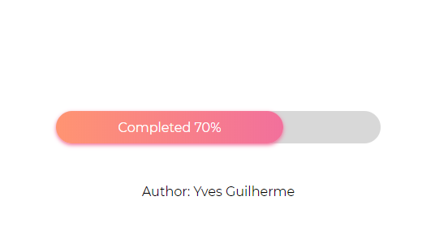
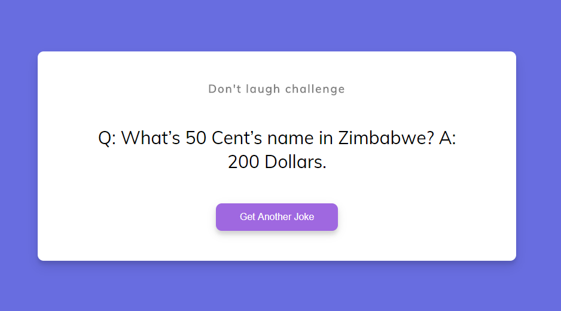

<h1 align="center">
    
</h1>

<h4 align="center">
    🚀 Repositório dedicado para pequenos projetos desenvolvidos com HTML, CSS e JavaScript.
</h4>

# 💻 Projetos

### :pushpin: Custom Progress Bar

### :pushpin: Dad Jokes Generator

---

Desenvolvido por Yves Guilherme :rocket:

